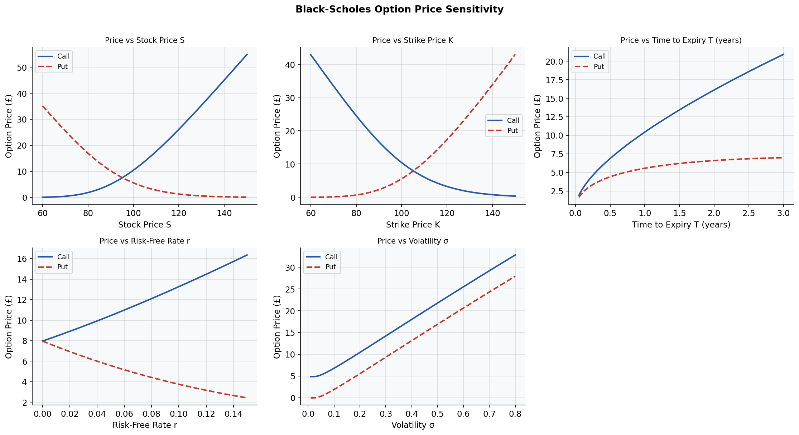
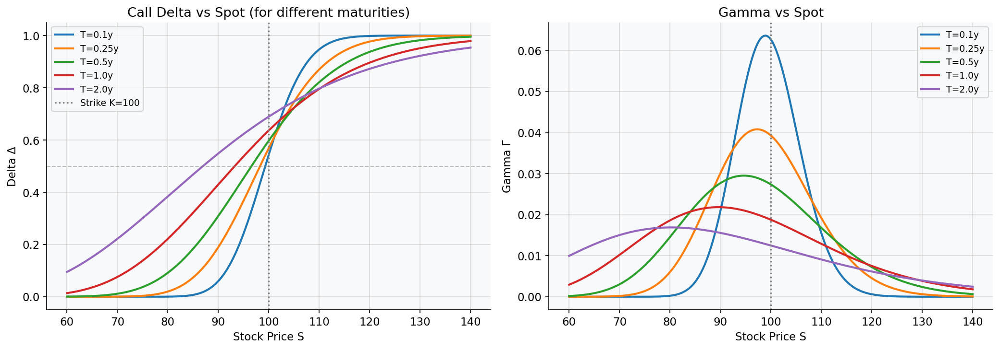
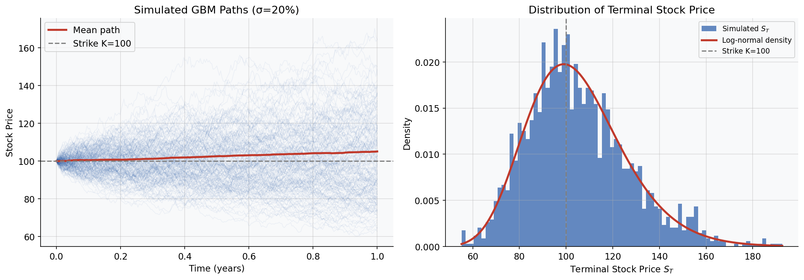
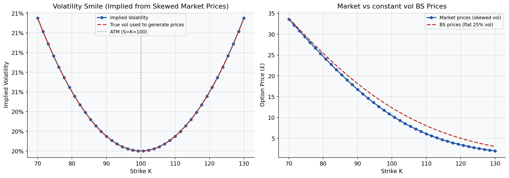
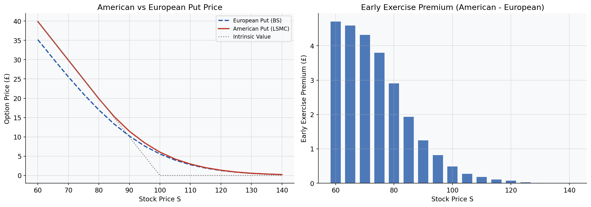
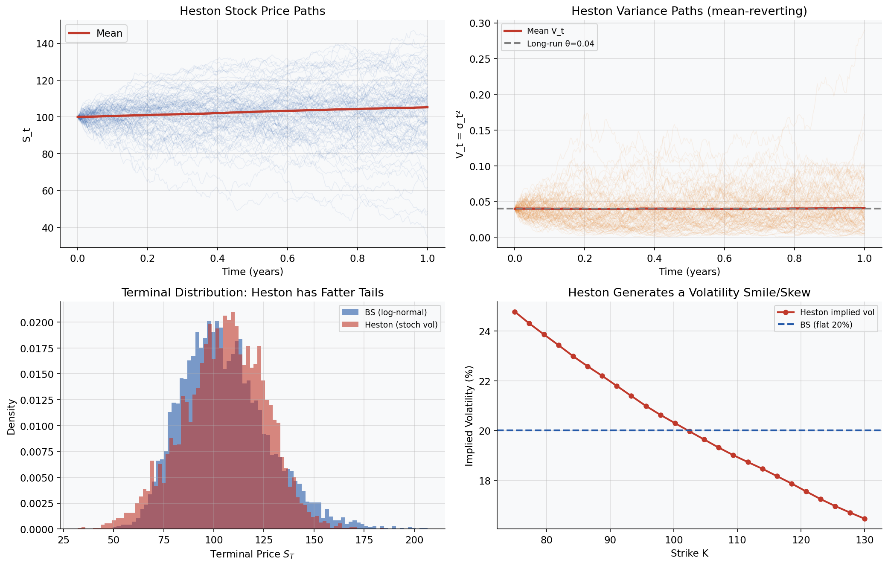
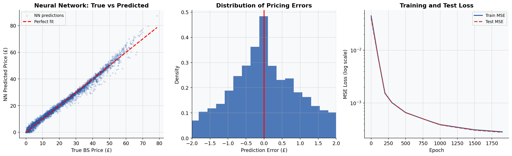

# Option Pricing Concepts

I had a basic idea about Option Pricing and the various models used for it, but I never got the opportunity to work in depth with real applications of the concepts. This repository is an attempt to extend my knowledge and prepare myself for a future in quant finance. It covers Black-Scholes derivation and closed form, sensitivity analysis, Greeks, Monte Carlo with variance reduction, implied volatility and the volatility smile, American options, the Heston model and a neural network pricer trained on 20,000 option contracts. Certainly there are many more applications that I can explore and so I keep returning to this repo and adding new ideas.

I want introduced to working with NNs during the Summer School at INRIA. This repo gave me an opportuity to use that newly learnt knowledge and produce something for myself.

Inside the notebook, there are many more comments which were important for me to correlaate the concepts to codes. 

---

## Highlights

| # | Concept | Important results | Plot |
|---|---|---|---|
| 1 | Black-Scholes derivation | Closed-form: Call = £10.45 at S=K=100, T=1y, σ=20% |  |
| 2 | The Greeks | Δ=0.637, Γ=0.019, ν=0.375, Θ=−£0.018/day |  |
| 3 | Monte Carlo pricing | Error shrinks as 1/√n , at 1M paths: error = £0.006 |  |
| 4 | Implied volatility and smile | IV recovered to 8 decimal places, smile reproduced from skewed prices |  |
| 5 | American options | Early exercise premium = £0.48 over European put |  |
| 6 | Heston Model | Mean-reverting variance, fatter tails than BS |  |
| 7 | Neural network for option pricing | R² = 0.988 · MAE = £1.20 on 4,000 unseen contracts |  |

---

## Inside the notebook

### 1. Black-Scholes derivation

The starting point is stock price following GBM and the goal is to price a derivative for it. The derivation has three steps and I think each step is genuinely interesting on its own.

**Step 1: Itô's lemma on V(S,t)**- The option price inherits randomness from S. Applying chain rule to its equation gives:

$$
dV = (∂V/∂t + μS·∂V/∂S + ½σ²S²·∂²V/∂S²)dt + σS·∂V/∂S·dW
$$

**Step 2: Delta hedging to remove noise**- Construct a portfolio $Π = V − ΔS$. Choosing $Δ = ∂V/∂S$ cancels the $dW$ term exactly. This makes the portfolio "locally riskless".

**Step 3: No arbitrage principle**- A riskless portfolio must earn the risk-free rate r, otherwise there would be arbitrage. Setting $dΠ = rΠ dt$ and substituting gives the Black-Scholes PDE:

$$
∂V/∂t + ½σ²S²·∂²V/∂S² + rS·∂V/∂S − rV = 0
$$

Solving this PDE with the boundary condition $V(S,T) = max(S−K, 0)$ gives the closed-form formula. 

Now I tested the formula with some standard parameters. Throughout this book, I've taken pounds as currency (for no particular reason though).

**Results**: At S=K=100, T=1y, r=5%, σ=20%:

| | Call | Put |
|---|---|---|
| Price | £10.4506 | £5.5735 |
| d1 | 0.3500 | — |
| d2 | 0.1500 | — |

Then I did some sensitivity plots related to these paramaters and prices. 

Note: This shows that option pricing is nonlinear. 
- Call price is monotone increasing in S, σ, T, r. 
- Put is exactly flipped in S and r. 
- Volatility increases the price of both put and call. We talk about this in more depth soon. 

---

### 2. The Greeks

We know that the Greeks measure how the option price changes with each input. I wanted to understand the roles of differentparameters clearly. So I have the following table:

**At S=K=100, T=1y, r=5%, σ=20%:**

| Greek | Symbol | Call | Put | Interpretation |
|---|---|---|---|---|
| Delta | Δ | 0.6368 | −0.3632 | £ change in option per £1 move in stock |
| Gamma | Γ | 0.0188 | 0.0188 | rate of change of Delta per £1 in stock |
| Vega | ν | 0.3752 | 0.3752 | £ change per 1% rise in volatility |
| Theta | Θ | −0.0176 | −0.0045 | £ decay per calendar day |
| Rho | ρ | 53.23 | −41.89 | £ change per 1% rise in rates |

Notes:
- Gamma and Vega are identical for calls and puts because of the put-call parity. 
- We use Delta for hedging. So Delta of +0.637 means that to hedge a long call I would have to short 0.637 shares of the underlying asset. 
- As S rises, Delta approaches 1 (deep ITM call). As S falls, Delta approaches 0. 
- Gamma peaks at-the-money and spikes near expiry.

---

### 3. Monte Carlo pricing

The BS closed form works for European options. But for other kinds of options, we need simulation. So our idea is to simulate many future stock price paths, compute the payoff on each, average them and discount.

Under the risk-neutral measure:

$$S_T = S_0 · exp[(r − σ²/2)T + σ√T·Z],   Z ~ N(0,1)$$

I use antithetic variates for variance reduction. 

**Results:** For S=K=100, T=1y, r=5%, σ=20%, BS exact = £10.451

| Paths | MC Price | Abs Error | 95% CI width |
|---|---|---|---|
| 1,000 | £10.000 | £0.450 | £1.743 |
| 10,000 | £10.410 | £0.041 | £0.578 |
| 100,000 | £10.467 | £0.017 | £0.183 |
| 1,000,000 | £10.457 | £0.006 | £0.058 |

We can see error shrinks as 1/√n. Here, at 1M paths we are within £0.006 of the exact price with a 95% CI of ±£0.029.

---

### 4. Implied volatility and the volatility smile

The BS formula takes σ as an input. In practice, we don't know σ, so we inverse BS formula. Given a market price, we find a sigmma that would producd it. That is the concept of implied volatility.

I have a code where we use a fixed sigma to to get a price but then invert that price and use Brent's method tto find a sigma. With that, we achieve an error of 2×10⁻¹⁰, which is quite nice. 

Next part is volatility smile. A limitation of BS is that it assumes constant σ across strikes. This is not true in real markets because OTM puts have a higher implied volatilities than ATM options. This plots like a smile, as seen below.

I simulate a market where the true volatility follows a quadratic smile, using the formula
$$ vol(K) = 0.20 + 0.15·(1 − K/S)²$$. 

Recovering IVs from the resulting option prices reproduces the smile. This confirms that the smile truly captures market pricing in case of risks. 

The right panel shows the a comaprison. BS with a fixed 25% vol misprices OTM options. This would lead to underestimating extreme risks and charging too little for protection against them. 

---

### 5. American options 

A European option is exercised only at maturity. An American option can be exercised at any point up to maturity. Here we get an added optimal stopping problem on top of the pricing problem.

At each time step

$$V_t = max(intrinsic value, continuation value)$$
i.e,
$$V_t = max(K − S_t,  E^Q[e^{−r·dt}·V_{t+dt} | S_t])$$

In order to calculate the continuation value we need the Longstaff Schwartz algorithm to approximate it by regressing discounted future payoffs on polynomial basis functions of $S_t$. We work backwards in time from expiry to approx

$$C(S_t) ≈ β₀ + β₁S_t + β₂S_t²$$

So this turns our optimal stopping problem into a bunch of regressions which are easier.

**Results**: For S=K=100, T=1y, r=5%, σ=20%, 50,000 paths:

| | Price |
|---|---|
| European put (BSCF) | £5.5735 |
| American put (LSMC) | £6.0513 |
| Early exercise premium | £0.4778 |

The American put is worth £0.48 more than the European which is what we call the value of the right to exercise early. This premium exists because for deep-in-the-money puts it can be better to exercise immediately rather than wait and succumb to time decay.

---

### 6. Heston stochastic volatility

As said before BS assumes constant volatility. Heston gave a model where variance too is an OU process:

$$dS = r·S·dt + √V·S·dW₁$$
$$dV = κ(θ − V)dt + ξ√V·dW₂$$
$$Corr(dW₁, dW₂) = ρ$$

where κ is the speed of mean reversion, θ is the long run variance, ξ is the volatility of volatility and ρ is the correlation between price and variance shocks (negative because stocks fall as volatility rises).

The Heston model is implemented via Euler-Maruyama discretisation of the joint (S,V) system. Since variance must stay positive, V is always positive.

Heston paths show bursts of volatility that BS paths lack. The fatter tails are evidently visible.

---

### 7. Neural network for option pricing

I wanted to figure out how an NN can learn BS pricing from data, without ever looking at the formula. I have the following setup:

**Dataset:** 20,000 random (S, K, T, r, σ) combinations, each labelled with the exact BS call price. Split 80/20 into train/test.

**Inputs:** log(S/K), T, r, σ, and S/K ratio. Target is normalised by S.

**Architecture:** 3-layer feedforward network, 64 hidden units per layer, SiLU activations, ReLU output (prices cannot be negative). Trained with Adam, learning rate halved every 500 epochs, 2000 epochs total.

**Training:**

| Epoch | Train MSE | Test MSE |
|---|---|---|
| 0 | 0.045066 | 0.041009 |
| 500 | 0.000656 | 0.000660 |
| 1000 | 0.000389 | 0.000386 |
| 1500 | 0.000310 | 0.000305 |

**Test set performance:** 4,000 unseen contracts

| Metric | Value |
|---|---|
| Mean Absolute Error | £1.198 |
| Median Absolute Error | £0.810 |
| Mean Relative Error | 27.2% |
| Max Absolute Error | £10.434 |
| R² score | 0.9883 |

- R² of 0.988 means the network explains 98.8% of variance in option prices across all strikes, maturities and vols in the test set. 
- The high mean relative error (27%) is caused by deep OTM options with small prices
- The median absolute error of £0.81 is best metric
- The max absolute error of £10.43 occurs on long dates and high volatility options where prices is large but network has less trainingn coverage so it underestimates it. This happens because of uniform random sample because of which input distributions are sparse.

The left panel shows the true vs predicted scatter clustering tightly around the diagonal. The middle panel shows the error distribution is roughly symmetric and centred at zero, so no bias. The right panel shows the loss curve converging cleanly.

---

## The Heston neural network doesn't work

I attempted to apply the same neural network approach to learn the Heston pricing function but the relative error was ~99.5%.

The BS network performs well because its pricing function is easy to normalise, i.e, dividing the option price by the stock price (S) keeps the target values within a relatively small range. In contrast, Heston prices depend on several additional parameters $V_0, \kappa, \theta$ and $\xi$, so dividing by S alone does not properly normalise the data. As a result, the network has to learn a much more complex and widely spread target distribution.

Given the relatively small dataset (3,000 samples) and limited training time (1,500 epochs), the model was unable to learn this relationship nicely. Improving performance would likely require better normalisation, a larger training dataset, or a more specialised network design. Lets see if I can return to this soon.

---

## Takeaways

The thing that I love the most in building this was how nicely everything connects. The σ²/2 in the GBM formula is the same Itô correction that appears in the BS PDE derivation. The early exercise premium for American options only exists because of time value, which is the same time decay Theta measures. Implied volatility being nonconstant across strikes is the market's way of pricing tails that BS cannot. And the neural network essentially compresses all of that into a set of weights without knowing any of it. That was the most impressive.

Learning things from this repo was really interesting and I hope some of this knowledge can be applicable at work.
